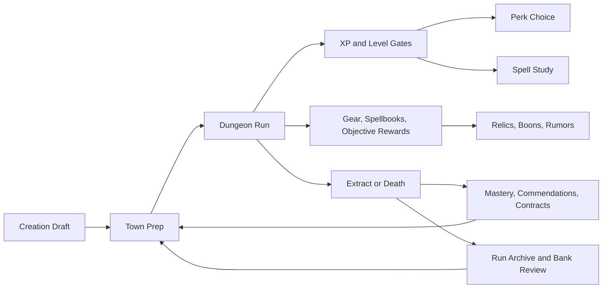

# Report

## Current progression systems

The current game has four distinct progression layers that overlap rather than forming one linear tree.

1. Creation-layer progression defines the starting build through race stats, class bonuses, starter items, starter spells, and allocatable training points in [`src/features/creation.js`](../../../src/features/creation.js) plus [`src/data/content.js`](../../../src/data/content.js).
2. Run-local progression grows the current character through monster XP, random stat growth, level-up perk choice, spell study, gear pickups, spellbooks, objective rewards, optional greed rewards, and town shopping or services in [`src/features/combat.js`](../../../src/features/combat.js), [`src/features/builds.js`](../../../src/features/builds.js), [`src/features/objectives.js`](../../../src/features/objectives.js), [`src/features/town-meta.js`](../../../src/features/town-meta.js), and [`src/game.js`](../../../src/game.js).
3. Persistent progression carries value across runs through class mastery ranks, commendations, contract unlocks, town unlock investments, run archives, and recommendation logic in [`src/features/meta-progression.js`](../../../src/features/meta-progression.js).
4. Derived-stat progression recalculates power continuously from race, class, level, gear, curses, constitution loss, relics, and perks in [`src/game.js`](../../../src/game.js) and [`src/features/builds.js`](../../../src/features/builds.js).

Mechanically, the core stat formulas are simple and readable. Attack scales from weapon power plus half Strength, armor from half Dexterity, evade from Dexterity, search radius from Dexterity and Intelligence thresholds, HP from Constitution plus level plus Fighter bias, and mana from Intelligence plus Wizard bias in [`src/game.js`](../../../src/game.js).

Level-ups are not just number bumps. When XP reaches `nextLevelExp`, the player gains a level, `nextLevelExp` scales upward, each primary stat gains `0` or `1` randomly, derived stats are recalculated, HP and mana refill, one spell choice is queued, and one perk choice is queued in [`src/features/combat.js`](../../../src/features/combat.js).

## Current spell systems

The spell layer is broad and structured.

- There are 20 implemented spells in [`src/data/content.js`](../../../src/data/content.js).
- Spells carry explicit metadata for school, tier, class affinity, learn level, cost, target mode, and description.
- The current affinities break into Fighter, Rogue, Wizard, and Shared families.
- Spell learning at level-up is filtered by current level, excludes already known spells, and sorts by class affinity first, then learn level, then mana cost in [`src/game.js`](../../../src/game.js).

Current spell acquisition routes:

1. Class start: Fighters begin with no spells, Rogues with `Magic Missile`, Wizards with `Magic Missile` and `Cure Light Wounds`.
2. Level-up spell study: Each level-up queues one spell-learning choice.
3. Spellbooks: Using a spellbook immediately teaches the spell if unknown, adds it to the tray when possible, and consumes the book in [`src/game.js`](../../../src/game.js).
4. Class mastery: Later mastery ranks can grant permanent starting spells such as `Shield`, `Identify`, and `Clairvoyance` in [`src/data/content.js`](../../../src/data/content.js) and [`src/features/meta-progression.js`](../../../src/features/meta-progression.js).

Spell use itself also shapes progression because mana economy matters. `Spell Efficiency` lowers mana cost, `Warding` increases mana, gear can add mana and warding, and overcasting converts mana shortage into Constitution loss with `Overcast Control` reducing that penalty in [`src/features/builds.js`](../../../src/features/builds.js) and [`src/game.js`](../../../src/game.js).

## Current skill/perk systems

The game does not currently expose a separate skill-tree screen. Instead, "skills" are split across class identity, perks, mastery ranks, spells, and gear properties.

Perks:

- 12 total implemented perks, four per class family, defined in [`src/data/content.js`](../../../src/data/content.js).
- Fighters: `Brace`, `Cleave`, `Shield Mastery`, `Blooded`
- Rogues: `Backstab`, `Evasion`, `Trap Sense`, `Quick Hands`
- Wizards: `Spell Efficiency`, `Element Focus`, `Overcast Control`, `Warding`

How perks work:

- Perk offers are rolled only from the player's class family in [`src/features/builds.js`](../../../src/features/builds.js).
- The perk modal appears before spell study on level-up in [`src/game.js`](../../../src/game.js).
- Implemented perk hooks currently affect waiting, splash damage, armor, evade, search bonus, mana cost, spell damage, overcast loss, and mana pool size.

Mastery:

- Each class has a four-rank mastery ladder in [`src/data/content.js`](../../../src/data/content.js).
- Ranks alternate between `objective` and `extract` triggers.
- Rewards are persistent and can grant items, rumor tokens, or permanent starting spells.
- The bank screen surfaces current mastery summary, ladder state, and next reward through [`src/game.js`](../../../src/game.js).

Commendations and contracts:

- Commendations are achievement-like persistent badges with unlock logic tied to run behavior such as clean extracts, greed-heavy extracts, route-heavy extracts, elite-heavy runs, curses, and class loyalty in [`src/features/meta-progression.js`](../../../src/features/meta-progression.js).
- Contracts are opt-in next-run modifiers that change starting loadout, route reveal, elite pressure, greed payout, or pacing pressure in [`src/data/content.js`](../../../src/data/content.js) and [`src/game.js`](../../../src/game.js).

## Current build-shaping mechanics

The strongest existing pillar is still build assembly, and the code supports that claim.

Main build shapers:

1. Race plus class create the starting stat shape and loadout.
2. Starter items already bias the run toward steel, scouting, or mana economy.
3. Equipment changes attack, armor, guard, ward, resistances, search bonus, carry burden, and overcast relief through core item stats in [`src/core/entities.js`](../../../src/core/entities.js).
4. Spellbooks are a second spell-acquisition channel outside level-up.
5. Perks add class-family-specific modifiers.
6. Relics add run-local build hooks.
7. Boons add burst rewards such as recovery, mana refill, gold, rumor tokens, or elite bounty setup.
8. Contracts reshape the next run's incentives and opening conditions.
9. Town unlocks change available shop tiers and future encounter or reward pools in [`src/features/town-meta.js`](../../../src/features/town-meta.js).

Objective rewards are intentionally varied rather than uniform. The current objective table mixes relic, boon, and rumor outcomes across `recover_relic`, `purge_nest`, `rescue_captive`, `seal_shrine`, `secure_supplies`, `recover_waystone`, `secure_ledger`, `purify_well`, `break_beacon`, and `light_watchfire` in [`src/data/content.js`](../../../src/data/content.js).

Milestone bosses also feed progression. Depth 3 grants a perk reward, depth 5 grants a relic reward, and depth 7 grants no explicit reward because it gates the Runestone end-state in [`src/data/content.js`](../../../src/data/content.js).

## How progression currently works across a run

1. The player drafts a character in creation: race, class, name, and six allocatable points.
2. Starting gear and starting spells establish the first build identity.
3. Entering town adds service-based growth: armory for gear, guild for spellbooks and magical tools, temple for restoration and rune access, sage for identification, bank for persistence planning.
4. Descending into the dungeon moves progression into run-local form: XP, pickups, spellbooks, objective rewards, greed rooms, and emergent curses or Constitution strain.
5. Level-ups interrupt the run with two sequential decisions: perk first, then spell study.
6. Floor objectives resolve into relic, boon, or rumor payouts depending on objective type.
7. Extracting to town can advance mastery, unlock contracts, unlock commendations, and update the bank's recommendation layer.
8. Funding town projects permanently expands future shop tiers and some encounter or reward pools.

In short, the run is not just "gain XP and level up." It is a layered feedback loop where the current run and next run constantly talk to each other.

## Strengths of the current design

- The system already has multiple legitimate build axes. Players can shape a run through stats, items, spells, perks, relics, boons, contracts, and town improvements rather than through one narrow upgrade path.
- Class identity is clear at the start. Fighter, Rogue, and Wizard are materially different in base stats, start kits, and spell access.
- Level-up pacing is more interesting than flat stat growth because every level generates both a perk and a spell decision.
- The persistent layer is meaningful. Mastery, commendations, contracts, and town unlocks create long-term motivation without replacing the run-level roguelike loop.
- Objective rewards vary enough to keep floor progression from feeling uniform.
- The bank is doing real systems work. It is not just storage; it is the game's persistence review, unlock planning, and next-run recommendation surface.

## Weaknesses or unclear areas

- The progression stack is distributed across many surfaces. Creation, bank, shops, pack, magic, level-up modals, objective rewards, and return summaries all own part of the progression story.
- Some layers are more visible than others. Perk and spell study are obvious, but mastery, commendations, and town unlock consequences are easier to miss unless the player reads the bank carefully.
- The system uses several currencies or persistence concepts at once: gold, banked gold, rumor tokens, contracts, mastery, commendations, and unlocks. That creates richness, but also cognitive overhead.
- Stat growth is mechanically important but visually understated. The player levels up, all four stats can grow randomly, and derived stats recalc, yet the UI emphasis is on the perk and spell decision rather than on the stat delta itself.
- Objective reward variety is strong in code, but some reward consequences are surfaced only through logs or later-state effects rather than through a persistent build summary.

## Gaps or underused systems

Several defined systems or rewards are present in data but look under-implemented or lightly surfaced in the current baseline.

- `Quick Hands` is defined in [`src/data/content.js`](../../../src/data/content.js) but has no clear gameplay hook elsewhere in `src/`.
- `Greedy Purse` and `Warding Lens` appear in relic definitions, but unlike `Survivor's Talisman`, `Anchoring Pin`, and `Hunter's Map`, they do not show obvious rule hooks in the current code search.
- `templeFavor` is initialized in run currency state, but no current spending or gain loop is obvious in the baseline code pass.
- The persistent layer is rich, but the run-to-run archive and recommendation logic are much more developed than the in-run summary of what has already been assembled.
- Because spellbooks directly teach spells and level-up also teaches spells, the game has two strong spell acquisition channels, but it does not currently present a single synthesized "spell progression" overview screen.

These gaps matter because they create a difference between "defined progression content" and "felt progression impact."

## Open questions

- Should the game continue to present progression as many overlapping layers, or does one layer deserve to become the primary build narrative?
- Are random `+0` or `+1` stat rolls on all four stats producing the intended feeling of growth, or are they too backgrounded compared with perks and spells?
- Does the current bank screen carry too many persistence jobs at once: archive, contracts, mastery, unlock funding, rumor buying, and next-run recommendation?
- Should spell progression remain split between level-up study and spellbook ingestion, or is there a need for stronger synthesis or differentiation?
- Are underwired data entries such as `Quick Hands`, `Greedy Purse`, `Warding Lens`, and `templeFavor` intentionally reserved for future work or currently incomplete?
- Do objective reward types create enough distinct build outcomes in practice, or do boon and rumor objectives still feel secondary next to relic objectives?
